## 5. Fibre-递增对比


> 这个故事是一个部分系列，`手动👋写自己-React`的版本，但因为我们要重写大部分旧代码的，无论如何，我会 tl;dr它为您提供：

---

>TL;DR : 到目前为止的系列：我们正在编写一个React克隆来了解React在底层做了什么。我们称之为[`Didact`](./readme.md)。为了简化代码，我们只关注-React-的主要功能。首先我们介绍如何渲染元素并使JSX工作。我们编写了对比算法来重新渲染仅更新之间更改的内容。然后我们添加了-`Component - class` 和 `setState()`。

---

<details>

<summary>说一说❤️react didact</summary>

现在`React-16`已经不复存在，并且有了一个新的内部架构，需要重写-React-的大部分代码。

这意味着一些期待已久的功能 - 旧的架构很难发展 - 被送走了🐶。

这也意味着我们在这个系列中编写的大部分代码现在都是毫无价值的。但是思想可以留下😛

在本文中，我们将重写-didact-系列中的大部分代码，以遵循React-16新架构。我们将尝试从React代码库中 模拟 结构，变量和函数名称。我们将跳过我们-公共API-所不需要的一切：

- `Didact.createElement()`

- `Didact.render()` （只有DOM渲染）

- `Didact.Component`（使用setState()但不是context生命周期方法）

如果你想跳到前面看代码工作，你可以去

[更新的演示-codepen](https://codepen.io/pomber/pen/veVOdd)或访问[->github存储库](https://github.com/hexacta/didact)。

现在, 让我解释为什么我们需要重写旧代码。
</details>

---

### 5.1 为什么选择Fiber

<details>

> 这不会提供`React-Fiber`的完整画面。如果您想了解更多信息，请查看-[`此资源列表`](https://github.com/koba04/react-fiber-resources)。

当浏览器的主线程忙于长时间运行时，关键的简短任务必须等待一段不可接受的时间才能完成。

为了展示这个问题，我做了一个[小演示](https://pomber.github.io/incremental-rendering-demo/react-sync.html)。为了保持行星的旋转，主线程需要每16ms左右一次就要使用。如果主线程被其他东西阻塞，让我们说200毫秒，你会注意到动画丢失帧和行星冻结，直到主线程再次释放。

> 是什么让主线程如此繁忙, 以至于无法为-保持`动画平滑`和`UI响应`的情况下节省一些微秒？

记住-[`对比代码`](./readme.md#3-实例-对比和虚拟dom)？一旦开始对比，它不会停止。如果主线程需要做其他任何事情，它将不得不等待。而且，`因为递归调用很大程度上取决于它，所以很难使它可以被使用`。这就是为什么我们要用一个新的数据结构来重写它，这将允许我们用`循环`-替换-`递归调用`。

---

> ## 提示 fibre 理解

[你是新手 请点击 观察 本🌰中两种不同 `jsbin-fibre`](http://jsbin.com/coyunux/2/edit?js,console)

- 看了上面这个🌰，你需要明白，`fibre` 带有数据流动 的认知

- 然后你看了 [`此资源列表`]((https://github.com/koba04/react-fiber-resources)) 了吗，为了加深-对-react-fibre 的认知, 我们需要其中的[demo-🌰子](https://koba04.github.io/react-fiber-resources/examples/)

`说回 react-fibre 这个念想 ` 在  带有数据的特性 的 `-fibre-`中 赋予了`-优先级-`属性记录，可以看到[demo-🌰子](https://koba04.github.io/react-fiber-resources/examples/) 带有共 三个选择或输入项 

  1. `pleace input text`

  > 没有变化的

  2. `Async mode` 默认

  > 使用了-[实验性`react.unstable_deferredUpdates` 会赋予此元素一个低优先级](https://sourcegraph.com/github.com/koba04/react-fiber-resources/-/blob/examples/components/App.js#L30)

  3. `sync mode`

  > 会到同步，也就是没有变化

可以看到 -`Async mode`- 的卡顿, 它这个组件元素被分配的优先级低，而
，`sync mode` 比 `Async mode` 优先级高, 为优先级高的让道。比如优先级高的动画。

> 当然，`react-fibre` 不止做了这件事:P
</details>

---

> 在这下面的翻译, 并`没有进行校对`, `React` 的 `Fibre` 改造正在进行, 关于 Fibre 的有效与影响

> 对 `React`的提升仍是`未知之数`, 所以在似乎了解 `Fibre` 的含义后, 我抽身了

### 5.2 调度微任务

<details>

我们需要将工作-分解为更小的部分，短时间运行这些部分，让主线程执行`更高优先级`的任务，并且如果有-任何待处理的事情-回来完成工作。

我们会在`requestIdleCallback()`功能的帮助下做到这一点。它会在下一次浏览器闲置时调用一个回调`deadline函数`，并包含一个`描述`我们的代码有多少可用时间的参数：

``` js
const ENOUGH_TIME = 1; // milliseconds

let workQueue = [];
let nextUnitOfWork = null;

function schedule(task) {
  workQueue.push(task);
  requestIdleCallback(performWork);
}

function performWork(deadline) {
  if (!nextUnitOfWork) {
    nextUnitOfWork = workQueue.shift();
  }

  while (nextUnitOfWork && deadline.timeRemaining() > ENOUGH_TIME) {
    nextUnitOfWork = performUnitOfWork(nextUnitOfWork);
  }

  if (nextUnitOfWork || workQueue.length > 0) {
    requestIdleCallback(performWork);
  }
}
```

真正的工作发生在`performUnitOfWork`函数内部。我们需要在那里编写我们的`对比-{reconciliation}`代码。该函数应该运行一部分工作，然后-`返回-{return}`-下一次需要恢复工作的所有信息。

为了跟踪这些工作，我们将使用`Fibre`。

</details>


### 5.3 Fibre-数据结构

<details>

我们将为每个想要渲染的组件创建一个`Fibre`。这`nextUnitOfWork`将是对我们想要工作的下一个`Fibre`的参考。`performUnitOfWork`将在该`Fibre`上工作，并返回一个`新的Fibre`-直到所有工作完成。容许我，我会稍后详细解释这一点。

`Fibre`是怎样的？

``` js
let fiber = {
  tag: HOST_COMPONENT,
  type: "div",
  parent: parentFiber,
  child: childFiber,
  sibling: null,
  alternate: currentFiber,
  stateNode: document.createElement("div"),
  props: { children: [], className: "foo"},
  partialState: null,
  effectTag: PLACEMENT,
  effects: []
};
```
这是一个普通的旧JavaScript对象。

我们将使用`parent`，`child`和`sibling`-属性-打造的`Fibre`树描述组件的树。

这`stateNode`将是对`Component`实例的引用。它可以是-`DOM元素`，也可以是用户定义的`Component-class`的实例。

例如：

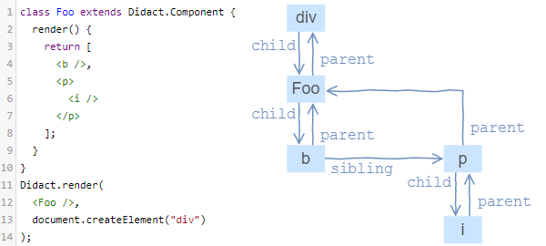

在这个例子中，我们可以看到我们将支持的三种不同类型的组件：

#### 1. 这 `-b-`，`-p-`和`-i-` 在 `Fibre` 表示 **host components**。

我们将用 
``` js 
tag: HOST_COMPONENT,
```
来识别它们。

`fibre.type`将是一个字符串（html元素的标签.

`fibre.props`将是元素的-属性-和-事件监听器-。

#### 2. 例子中 `<Foo>` 在 `Fibre` 中 表示 **class component**。它的`tag`是`CLASS_COMPONENT`和`type` 参考来自 用户定义 的 `Didact.Component`。

#### 3. `div `代表 **host root** 的`Fibre`。它与 **host component** 相似，因为它具有DOM元素作为`stateNode`，但是它将受到特殊处理。`Fibre.tag`会是**HOST_ROOT**。请注意，`Fibre.stateNode`是传递给的DOM节点`Didact.render()`。

另一个重要的属性是`alternate`。我们需要它，因为大多数时候我们会有两棵`Fibre`树。

- 一棵树将对应于我们已经呈现给-`html-DOM`-的东西，我们将它称为当前树或旧树。

- 另一棵是我们在创建新更新（调用`setState()`或 `Didact.render()` 时构建的树，我们将此树称为正在进行中的树

正在进行的工作树不会与旧树共享任何`Fibre`。一旦我们完成建设-`正在进行树`-工作并取得所需的 DOM变化，`正在进行树`成为旧树。

因此，我们使用`alternate`链接 正在工作的`Fibre`树 与 旧树 中相应的`Fibre`。`Fibre`和它的`alternate` 分享 相同`tag`，`type`,`stateNode`。有时 - 当我们渲染新的东西时 - `Fibre`不会有`alternate`。

最后，我们有`effects`清单和`effectTag`。当我们发现在工作`正在进行树`的`Fibre`，需要改变的DOM，我们将设置`effectTag`到`PLACEMENT`，`UPDATE`或`DELETION`。为了更容易将所有- DOM变化 一起提交，我们保留了列出的所有`Fibre`（来自`Fibre`子树）的`effectTag`列表`effects`。

> 这可能是一次太多的信息，如果你没有跟上，不要担心，我们很快就会看到`Fibre`树在运行。

</details>

---

### 5.4 Didact调用层次结构

要了解我们要编写的代码的流程，请查看此图表：

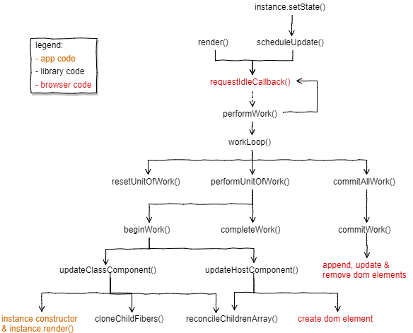

我们将从`render()`和开始，`setState()`并按照结束于的流程进行`commitAllWork()`。

---

#### 5.4.1 旧代码

<details>

我告诉过你，我们将重写大部分代码，但我们首先回顾一下我们不重写的代码。

在[`createElement和JSX`](./)中，我们编写了用于编译JSX的函数的代码`createElement()`。我们不需要改变它，我们将继续使用相同的元素。如果你不知道的元素，`type，props和children`，请查看旧帖子。

在[实例中](./)，我们编写了`updateDomProperties()`用于更新节点DOM属性的[调节和虚拟DOM](./)。我还提取了用于创建DOM元素的代码`createDomElement()`。你可以在这个[dom-utils.js的gist](https://gist.github.com/pomber/c63bd22dbfa6c4af86ba2cae0a863064)中看到这两个函数。

在[组件和状态](./)中，我们编写了Component-基类。让我们改变它以便`setState()`调用`scheduleUpdate()`，并`createInstance()`保存对实例中`Fibre`的引用：

``` js
class Component {
  constructor(props) {
    this.props = props || {};
    this.state = this.state || {};
  }

  setState(partialState) {
    scheduleUpdate(this, partialState); // <==
  }
}

function createInstance(fiber) {
  const instance = new fiber.type(fiber.props);
  instance.__fiber = fiber;
  return instance;
}
```

---

从这段代码开始，让我们从头开始重写其余部分。
</details>

#### 5.4.2

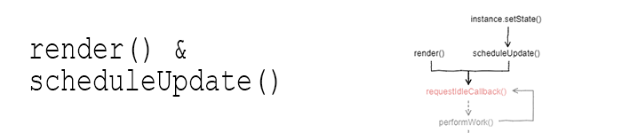

<details>

除了`Component` class 和 `createElement()` 之外，我们还会有两个公共函数：`render()` 和 `setState()`，我们看到这`setState()`只是调用`scheduleUpdate()`。

`render()`和`scheduleUpdate()`是相似的，他们会收到一个新的更新并对其进行排队：

``` js
// Fiber tags
const HOST_COMPONENT = "host";
const CLASS_COMPONENT = "class";
const HOST_ROOT = "root";

// Global state
const updateQueue = [];
let nextUnitOfWork = null;
let pendingCommit = null;

function render(elements, containerDom) {
  updateQueue.push({
    from: HOST_ROOT,
    dom: containerDom,
    newProps: { children: elements }
  });
  requestIdleCallback(performWork);
}

function scheduleUpdate(instance, partialState) {
  updateQueue.push({
    from: CLASS_COMPONENT,
    instance: instance,
    partialState: partialState
  });
  requestIdleCallback(performWork);
}
```

我们将使用该`updateQueue`数组来跟踪待处理的更新。每次打运行`render()`或`scheduleUpdate()`推送一个新的更新到`updateQueue`。每个更新中的更新信息都不同，我们将看到我们以后如何使用它`resetNextUnitOfWork()`。

将更新推送到队列后，我们触发延迟呼叫`performWork()`。
</details>

---


#### 5.4.3

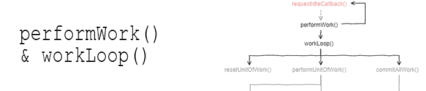

<details>

``` js
const ENOUGH_TIME = 1; // milliseconds

function performWork(deadline) {
  workLoop(deadline);
  if (nextUnitOfWork || updateQueue.length > 0) {
      // 是否 有 待审批工作
    requestIdleCallback(performWork);
  }
}

function workLoop(deadline) {
  if (!nextUnitOfWork) {
    resetNextUnitOfWork();
  }
  while (nextUnitOfWork && deadline.timeRemaining() > ENOUGH_TIME) {
      // 关注时间 是否足够 运行另一个工作单元
    nextUnitOfWork = performUnitOfWork(nextUnitOfWork);
  }
  if (pendingCommit) {
    commitAllWork(pendingCommit);
  }
}
```

这是我们使用`performUnitOfWork()`之前看到的模式的地方。

`requestIdleCallback()`以`截止日期-{deadline}`为参数调用目标函数。`performWork()`将`deadline`传给它`workLoop()`。然后`workLoop()`返回，`performWork()`检查是否还有待审批工作。如果有的话，它会为它自己安排一个新的`requestIdleCallback(performWork)`。

`workLoop()`是关注时间的功能。如果`deadline`太近，它会停止工作循环并保持`nextUnitOfWork`更新状态，以便下次恢复。

我们使用`ENOUGH_TIME`（1ms常数，与React相同）来检查是否`deadline.timeRemaining()`足以运行另一个工作单元。如果`performUnitOfWork()`超过这一点，我们将超过最后期限。`deadline`只是来自浏览器的建议，所以将其超过几毫秒并不是那么糟糕。
`performUnitOfWork()`将为其正在进行的更新构建`正在进行工作树`，并找出我们需要对-DOM-应用哪些更改。**这将逐步完成，每次一段`Fibre`数据**。

当`performUnitOfWork()`完成当前更新的所有工作时，它将`返回null`并将待处理的更改留在DOM中`pendingCommit`。最后，`commitAllWork()`将采取`effects`从`pendingCommit`, 还会`变更DOM`。

请注意，`commitAllWork()`在循环之外调用。

完成的工作`performUnitOfWork()`不会改变DOM，因此可以将其分开。

另一方面，`commitAllWork()`将改变DOM，它应该一次完成，以避免不一致的UI。

---

> 我们还没有看到第一个`nextUnitOfWork`来自哪里。
</details>

---

#### 5.4.4

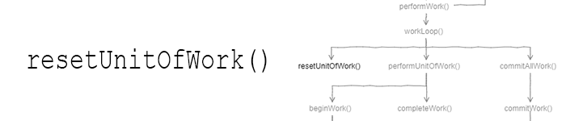

<details>

`resetNextUnitOfWork()`更新一次并将其转换为第一个`nextUnitOfWork`：

``` js
function resetNextUnitOfWork() {
  const update = updateQueue.shift();
  if (!update) {
    return;
  }

  // Copy the setState parameter from the update payload to the corresponding fiber
  if (update.partialState) {
    update.instance.__fiber.partialState = update.partialState;
  }

  const root =
    update.from == HOST_ROOT
      ? update.dom._rootContainerFiber
      : getRoot(update.instance.__fiber);

  nextUnitOfWork = {
    tag: HOST_ROOT,
    stateNode: update.dom || root.stateNode,
    props: update.newProps || root.props,
    alternate: root
  };
}

function getRoot(fiber) {
  let node = fiber;
  while (node.parent) {
    node = node.parent;
  }
  return node;
}
```

`resetNextUnitOfWork()` 首先从队列中提取第一个更新。

如果更新有，`partialState`我们将它存储在属于组件实例的`Fibre`上，以便稍后在调用组件时使用它`render()`。

然后我们找到老`Fibre`树的根。如果更新来自于第一次`render()`被调用时，我们会不会有一个根`Fibre`所以`root == null`。如果它来自后续调用`render()`，我们可以`_rootContainerFiber`在DOM节点的属性上找到根。如果更新来自a setState()，我们需要从实例`Fibre`上去，直到找到没有`Fibre`-**parent**。

然后我们分配`nextUnitOfWork`一个新的`Fibre`。这种`Fibre`是一个新的工作进行中的树的根。

如果我们没有一个旧的根，那么`stateNode`这个**DOM节点**就在`render()`调用中作为参数接收。这`props`将是`newProps`从更新：一个`children`属性的对象具有元素 - 的另一个参数`render()`。该`alternate == null`。

如果我们有一个旧的根，那么`stateNode`将是前一个根的**DOM节点**。该`props`会又`newProps`如果不是null，否则我们复制`props`从老根。这alternate将是老根。


---

我们现在拥有`正在进行中的树`的根，让我们开始构建剩余的树。

---

</details>

---

#### 5.4.5

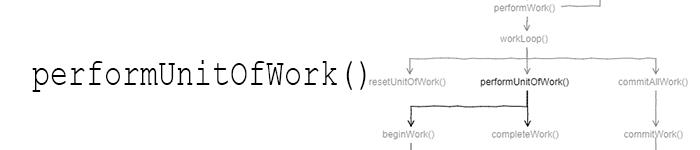

<details>

``` js

function performUnitOfWork(wipFiber) {
  beginWork(wipFiber);
  if (wipFiber.child) {
    return wipFiber.child;
  }

  // No child, we call completeWork until we find a sibling
  let uow = wipFiber;
  while (uow) {
    completeWork(uow);
    if (uow.sibling) {
      // Sibling needs to beginWork
      return uow.sibling;
    }
    uow = uow.parent;
  }
}
```
`performUnitOfWork()` 走在进行中的工作树。

我们称之为`beginWork()` - 创造一种`Fibre`的新生儿 - 然后让第一个孩子回到原来的状态`nextUnitOfWork`。

如果没有任何的孩子，我们呼吁`completeWork()`并返回sibling的`nextUnitOfWork`。

如果没有sibling，我们会去找父母打电话，`completeWork()`直到我们找到sibling（我们将成为`nextUnitOfWork`）或直到我们到达根部。

`performUnitOfWork()`多次呼叫会沿着树木向下，造成每根`Fibre`的第一个孩子的孩子，直到找到没有孩子的`Fibre`。然后它就像兄弟姐妹一样向右移动。而且它也跟叔叔一样。（为了更加生动的描述，尝试在`Fibre`调试器上渲染一些组件）

---
</details>

---

#### 5.4.6

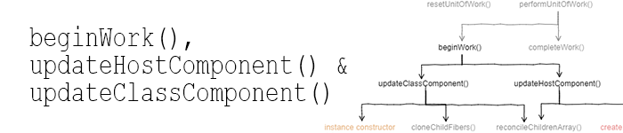


<details>

``` js
function beginWork(wipFiber) {
  if (wipFiber.tag == CLASS_COMPONENT) {
    updateClassComponent(wipFiber);
  } else {
    updateHostComponent(wipFiber);
  }
}

function updateHostComponent(wipFiber) {
  if (!wipFiber.stateNode) {
    wipFiber.stateNode = createDomElement(wipFiber);
  }
  const newChildElements = wipFiber.props.children;
  reconcileChildrenArray(wipFiber, newChildElements);
}

function updateClassComponent(wipFiber) {
  let instance = wipFiber.stateNode;
  if (instance == null) {
    // Call class constructor
    instance = wipFiber.stateNode = createInstance(wipFiber);
  } else if (wipFiber.props == instance.props && !wipFiber.partialState) {
    // No need to render, clone children from last time
    cloneChildFibers(wipFiber);
    return;
  }

  instance.props = wipFiber.props;
  instance.state = Object.assign({}, instance.state, wipFiber.partialState);
  wipFiber.partialState = null;

  const newChildElements = wipFiber.stateNode.render();
  reconcileChildrenArray(wipFiber, newChildElements);
}
```

`beginWork()` 做两件事：

创造`stateNode`如果我们没有一个
获取组件子项并将它们传递给 `reconcileChildrenArray()`
因为两者都取决于我们处理的组件的类型，所以我们将它分成两部分：`updateHostComponent()`和`updateClassComponent()`。

`updateHostComponent()`处理主机组件以及根组件。如果需要的话，它会创建一个新的DOM节点（只有一个节点，没有子节点，并且不会将其附加到DOM）。然后它`reconcileChildrenArray()`使用`Fibre`中的子元素进行调用`props`。

`updateClassComponent()`处理类组件实例。如果需要的话，它会创建一个调用组件构造函数的新实例。它更新实例`props`，`state`因此它可以调用该render()函数来获取新的子项。

`updateClassComponent()`也验证是否有意义调用`render()`。这是一个简单的版本`shouldComponentUpdate()`。如果看起来我们不需要重新渲染，那么我们只是将当前的子树克隆到正在进行的工作树中，而不进行任何调整。

---

现在，我们已经`newChildElements`准备好为正在进行中的`Fibre`创建子`Fibre`。
</details>

---


#### 5.4.7

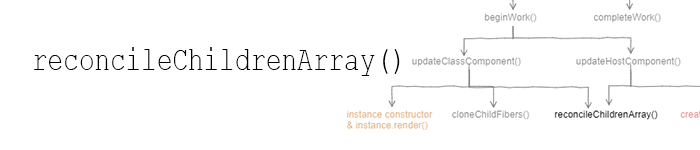

<details>

``` js
// Effect tags
const PLACEMENT = 1;
const DELETION = 2;
const UPDATE = 3;

function arrify(val) {
  return val == null ? [] : Array.isArray(val) ? val : [val];
}

function reconcileChildrenArray(wipFiber, newChildElements) {
  const elements = arrify(newChildElements);

  let index = 0;
  let oldFiber = wipFiber.alternate ? wipFiber.alternate.child : null;
  let newFiber = null;
  while (index < elements.length || oldFiber != null) {
    const prevFiber = newFiber;
    const element = index < elements.length && elements[index];
    const sameType = oldFiber && element && element.type == oldFiber.type;

    if (sameType) {
      newFiber = {
        type: oldFiber.type,
        tag: oldFiber.tag,
        stateNode: oldFiber.stateNode,
        props: element.props,
        parent: wipFiber,
        alternate: oldFiber,
        partialState: oldFiber.partialState,
        effectTag: UPDATE
      };
    }

    if (element && !sameType) {
      newFiber = {
        type: element.type,
        tag:
          typeof element.type === "string" ? HOST_COMPONENT : CLASS_COMPONENT,
        props: element.props,
        parent: wipFiber,
        effectTag: PLACEMENT
      };
    }

    if (oldFiber && !sameType) {
      oldFiber.effectTag = DELETION;
      wipFiber.effects = wipFiber.effects || [];
      wipFiber.effects.push(oldFiber);
    }

    if (oldFiber) {
      oldFiber = oldFiber.sibling;
    }

    if (index == 0) {
      wipFiber.child = newFiber;
    } else if (prevFiber && element) {
      prevFiber.sibling = newFiber;
    }

    index++;
  }
}
```

这是本库的核心，`正在进行的工作树`在不断增长，我们决定在提交阶段对-DOM-做什么更改。


开始之前，我们确保`newChildElements`是一个数组。（与之前的对比算法不同，这个算法总是与子数组一起工作，这意味着我们现在可以在组件的`render()`函数上返回数组）

然后我们开始比较旧`Fibre`树的孩子和新元素（我们将`Fibre`与元素进行比较）。来自老`Fibre`树的孩子们都是孩子们的孩子`wipFiber.alternate`。新元素是我们`wipFiber.props.children`从调用或从调用中获得的元素`wipFiber.stateNode.render()`。

我们-算法通过 第一`Fibre`（匹配`wipFiber.alternate.child`）与第一子元素（elements[0]），第二旧`Fibre`（`wipFiber.alternate.child.sibling`）的第二子元素（elements[1]）等。而对于每 对 `oldFiber` - `element` ：

- 如果`oldFiber`和`element`同样的`type`好消息，这意味着我们可以保留旧的`stateNode`。我们创建一个基于旧的`Fibre`的新`Fibre`。

我们添加`UPDATE effectTag`。我们将新`Fibre`添加到`正在进行的工作树`中。

- 如果我们`element`与我们有一个不同`type`的`oldFiber`或者我们没有`oldFiber`（因为我们有比新的孩子更多的新孩子），我们创建一个新的`Fibre`与我们的信息`element`。请注意，这种新`Fibre`没有`alternate`，也不会有`stateNode`（`stateNode`我们将创建`beginWork()`）。该`Fibre`的`effectTag`是`PLACEMENT`。

- 如果`oldFiber`和`element`有不同的`type`或没有任何`element`这`oldFiber`（因为我们有更多的老孩子比新来的孩子），我们将标记`oldFiber`为`DELETION`。鉴于这种`Fibre`不是正在进行工作的树的一部分，我们需要将它添加到`wipFiber.effects`列表中，以便我们不会丢失它的踪迹。

> 与React不同的是，我们没有使用 <kbd>key</kbd> 来进行比对，所以我们不知道一个孩子是否从之前的位置移动过来。

---
</details>

---

#### 5.4.8

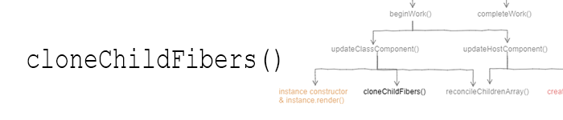


<details>

`updateClassComponent()` 有一个特殊情况，我们采取快捷方式，将旧的`Fibre`子树克隆到正在进行中的工作树，而不是进行调整。

``` js
function cloneChildFibers(parentFiber) {
  const oldFiber = parentFiber.alternate;
  if (!oldFiber.child) {
    return;
  }

  let oldChild = oldFiber.child;
  let prevChild = null;
  while (oldChild) {
    const newChild = {
      type: oldChild.type,
      tag: oldChild.tag,
      stateNode: oldChild.stateNode,
      props: oldChild.props,
      partialState: oldChild.partialState,
      alternate: oldChild,
      parent: parentFiber
    };
    if (prevChild) {
      prevChild.sibling = newChild;
    } else {
      parentFiber.child = newChild;
    }
    prevChild = newChild;
    oldChild = oldChild.sibling;
  }
}
```

`cloneChildFibers()`克隆每个`wipFiber.alternate`孩子并将其附加到`正在进行中的树`中。我们不需要添加任何内容，`effectTag`因为我们确信没有任何变化。


</details>

---

#### 5.4.9

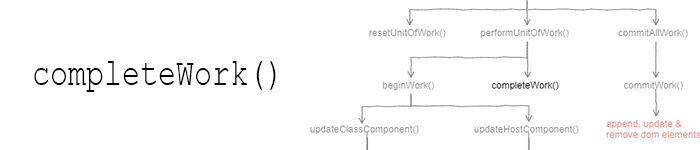

<details>

在`performUnitOfWork()`a wipFiber没有新的孩子或者我们已经完成了所有孩子的工作时，我们打电话给他`completeWork()`。

``` js
function completeWork(fiber) {
  if (fiber.tag == CLASS_COMPONENT) {
    fiber.stateNode.__fiber = fiber;
  }

  if (fiber.parent) {
    const childEffects = fiber.effects || [];
    const thisEffect = fiber.effectTag != null ? [fiber] : [];
    const parentEffects = fiber.parent.effects || [];
    fiber.parent.effects = parentEffects.concat(childEffects, thisEffect);
  } else {
    pendingCommit = fiber;
  }
}
```

`completeWork()`首先更新与类组件实例相关的`Fibre`引用。（说实话，这并不是真的需要在这里，但它必须在某个地方）

然后它建立一个列表`effects`。该列表将包含来自正在进行中的子树的所有`Fibre.effectTag`（它也包含来自旧子树的`Fibre`-`DELETION effectTag`）。这个想法是在根`effects`表中累积所有的`Fibre.effectTag`。

最后，如果`Fibre`没有**parent**，我们就是正在进行工作的树的根。所以我们完成了这次更新的所有工作并收集了所有的效果。我们分配根，`pendingCommit`以便`workLoop()`可以调用`commitAllWork()`。
</details>

---

#### 5.4.10

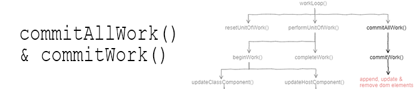


<details>

我们需要做的最后一件事是：改变DOM。

``` js
function commitAllWork(fiber) {
  fiber.effects.forEach(f => {
    commitWork(f);
  });
  fiber.stateNode._rootContainerFiber = fiber;
  nextUnitOfWork = null;
  pendingCommit = null;
}

function commitWork(fiber) {
  if (fiber.tag == HOST_ROOT) {
    return;
  }

  let domParentFiber = fiber.parent;
  while (domParentFiber.tag == CLASS_COMPONENT) {
    domParentFiber = domParentFiber.parent;
  }
  const domParent = domParentFiber.stateNode;

  if (fiber.effectTag == PLACEMENT && fiber.tag == HOST_COMPONENT) {
    domParent.appendChild(fiber.stateNode);
  } else if (fiber.effectTag == UPDATE) {
    updateDomProperties(fiber.stateNode, fiber.alternate.props, fiber.props);
  } else if (fiber.effectTag == DELETION) {
    commitDeletion(fiber, domParent);
  }
}

function commitDeletion(fiber, domParent) {
  let node = fiber;
  while (true) {
    if (node.tag == CLASS_COMPONENT) {
      node = node.child;
      continue;
    }
    domParent.removeChild(node.stateNode);
    while (node != fiber && !node.sibling) {
      node = node.parent;
    }
    if (node == fiber) {
      return;
    }
    node = node.sibling;
  }
}
```

`commitAllWork()`首先迭代每个根上`effects`调用的所有根`commitWork()`。`commitWork()`检查effectTag每根`Fibre`：


- 如果是，PLACEMENT我们查找父DOM节点，然后简单地追加`Fibre.stateNode`。

- 如果是这样的话，`UPDATE`我们会把`stateNode`旧道具和新道具放在一起，然后`updateDomProperties()`决定要更新什么。

- 如果它是`a DELETION`并且`Fibre`是主机组件，那很简单，我们只是打电话`removeChild()`。但是如果`Fibre`是类组件，在调用之前，`removeChild()`我们需要从`Fibre`子树中找到需要删除的所有主机组件。

一旦我们完成了所有的效果，我们可以重置`nextUnitOfWork`和`pendingCommit`。正在进行的工作树不再是正在进行中的工作树，并成为旧树，因此我们将其根指定给`_rootContainerFiber`。之后，我们完成当前的更新，我们准备开始下一个🚀。
</details>

---

### 5.5 正在运行的Didact

如果你想把所有的东西放在一起，只公开API，你可以这样做：

``` js
function importDidact() {
  // ...
  // All the code we wrote
  // ...

  return {
    createElement,
    render,
    Component
  };
}

/** @jsx Didact.createElement */
const Didact = importDidact();

class HelloMessage extends Didact.Component {
  render() {
    return <div>Hello {this.props.name}</div>;
  }
}

Didact.render(
  <HelloMessage name="John" />,
  document.getElementById("container")
);
```

或者你可以使用的[演示更新版本](https://codepen.io/pomber/pen/veVOdd)。所有这些代码也可以在[Didact的仓库](https://github.com/hexacta/didact)和[npm - didact](https://unpkg.com/didact)中获得。

---

### 5.6 下一步是什么？
Didact缺少很多React的功能，但我特别有兴趣根据优先级安排更新：

``` js
module.exports = {
  NoWork: 0, // No work is pending.
  SynchronousPriority: 1, // For controlled text inputs. Synchronous side-effects.
  TaskPriority: 2, // Completes at the end of the current tick.
  HighPriority: 3, // Interaction that needs to complete pretty soon to feel responsive.
  LowPriority: 4, // Data fetching, or result from updating stores.
  OffscreenPriority: 5, // Won't be visible but do the work in case it becomes visible.
};
```

[react-源](https://github.com/facebook/react/blob/5f93ee6f6ce068228b01516c021c9054b627bf11/src/renderers/shared/fiber/ReactPriorityLevel.js)

所以啊，下一篇文章可能会这样。

就这样！如果你喜欢它，不要忘记拍手👏，在[Twitter上关注我](https://twitter.com/pomber)，发表评论和所有这些内容。

谢谢阅读。!!