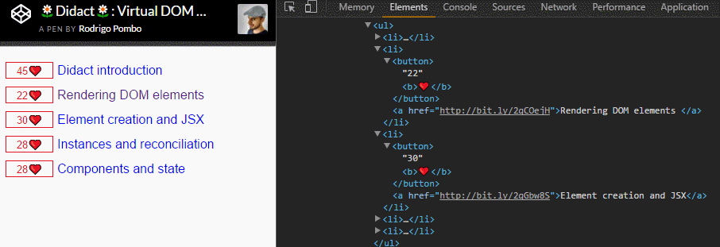
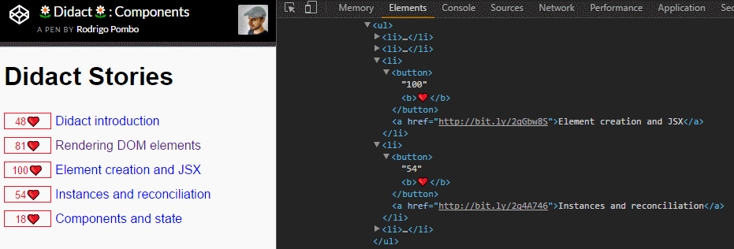

# didact

「 一个DIY指南建立你自己的反应 」

[](https://github.com/chinanf-boy/Source-Explain)

[github source](https://github.com/hexacta/didact) |  [english](https://engineering.hexacta.com/didact-learning-how-react-works-by-building-it-from-scratch-51007984e5c5)

---

### 一步一步地来, 本文只是对作者-项目-解释-的中文翻译 「英文原版需要翻墙」

`我很想知道React`

幸运的是，如果我们不关心性能，可调试性，可移植性等等，React的三个或四个主要特性并不是很难重写。

实际上，它们非常简单，可以用不到200行代码编写。

我们将这样做。使用相同的API在不到200行的代码中编写React的工作版本。鉴于这个图书馆的教学性质，我们将其称为`Didact`。

---

我们将在以下帖子中一次性向 `Didact` 添加一些功能：

- [`渲染DOM元素`](#1-%E6%B8%B2%E6%9F%93dom%E5%85%83%E7%B4%A0)

- [`元素创建和JSX`](#2-%E5%85%83%E7%B4%A0%E5%88%9B%E5%BB%BA%E5%92%8Cjsx)

- [`实例 - 对比和虚拟DOM`](#3-实例-对比和虚拟dom)

- [`组件和状态`](#4-组件和状态)

- [`Fibre：递增对比`](#5-fibre-递增对比)

---

[>>> 最后成果 codepen.io](https://codepen.io/pomber/pen/RVqBrx?editors=0010)

---


## 1. 渲染DOM元素

<details>

> 这个故事是我们一步一步构建自己版本的React的系列文章的一部分：

### 1.1 DOM审查

在我们开始之前，让我们回顾一下我们将使用的DOM API：

``` js
// Get an element by id
const domRoot = document.getElementById("root");
// Create a new element given a tag name
const domInput = document.createElement("input");
// Set properties
domInput["type"] = "text";
domInput["value"] = "Hi world";
domInput["className"] = "my-class";
// Listen to events
domInput.addEventListener("change", e => alert(e.target.value));
// Create a text node
const domText = document.createTextNode("");
// Set text node content
domText["nodeValue"] = "Foo";
// Append an element
domRoot.appendChild(domInput);
// Append a text node (same as previous)
domRoot.appendChild(domText);
```

> [>>> codepen.io](https://codepen.io/pomber/pen/aWBLJR)

请注意，我们正在设置[元素属性而不是属性](http://stackoverflow.com/questions/6003819/properties-and-attributes-in-html)。这意味着只允许有效的属性。

### 1.2 Didact元素

我们将使用普通的JS对象来描述需要渲染的东西。我们将它们称为`Didact Elements`。

这些元素有两个必需的属性：`type`和`props`。

- `type`可以是一个**{字符串string}**或一个**{函数function}**, 但我们将只使用-字符串-，直到我们在稍后的帖子中引入-组件-。

- `props`是可以为空的对象（但不为空）。`props`可能有一个`children`属性，它应该是一个`Didact元素`的数组。

> 我们会很多地使用`Didact Elements`，所以从现在开始我们只会称它们为**{元素element}**, 不要与`HTML element`混淆.

例如，像这样的一个元素：

``` js
const element = {
  type: "div",
  props: {
    id: "container",
    children: [
      { type: "input", props: { value: "foo", type: "text" } },
      { type: "a", props: { href: "/bar" } },
      { type: "span", props: {} }
    ]
  }
};
```

描述这个dom:

``` html
<div id="container">
  <input value="foo" type="text">
  <a href="/bar"></a>
  <span></span>
</div>
```

---

`Didact-元素`与`React-元素`非常相似。

但是通常你在使用`React`时不会创建`React-元素`作为JS对象，

你可能使用`JSX`或者甚至是`createElement`。

我们将在`Didact`中做同样的事情，但我们将会在系列下一篇文章中描述-`createElement`-的代码。

---

### 1.3 渲染-DOM-元素

下一步是将元素及其子元素呈现给dom。

我们将使用一个`render`函数（相当于`ReactDOM.render`）接收一个元素和一个`dom容器`。

该函数应该创建由`element`定义的`dom子树`并将其附加到`容器`中：

``` js
function render(element, parentDom) {
  const { type, props } = element; // 获取类型 和 属性对象
  const dom = document.createElement(type); // 创建-类型-element
  const childElements = props.children || []; // 获取-孩子
  childElements.forEach(childElement => render(childElement, dom)); // 每个孩子 都要加入-爸爸妈妈-的怀抱
  // 
  parentDom.appendChild(dom); // 爸爸妈妈加入爷爷奶奶的怀抱
}
```

我们仍然缺少`属性`和`事件监听器`。让我们`props`用`Object.keys`函数`迭代`属性名称并相应地-设置-它们：

``` js
function render(element, parentDom) {
  const { type, props } = element;
  const dom = document.createElement(type);

  const isListener = name => name.startsWith("on");
  // 是否开头-on
  Object.keys(props).filter(isListener).forEach(name => {
    const eventType = name.toLowerCase().substring(2); // 取两位后
    dom.addEventListener(eventType, props[name]);
  });
  // 每一个开头-on 的属性-对应-函数 props[name] - >用-dom-addEvent 接连

  const isAttribute = name => !isListener(name) && name != "children";
  // 不是-监听事件 和 不能是-孩子 

  Object.keys(props).filter(isAttribute).forEach(name => {
    dom[name] = props[name];
  });
 // 过滤出来的属性 - 赋予 - > dom
  const childElements = props.children || [];
  childElements.forEach(childElement => render(childElement, dom));

  parentDom.appendChild(dom);
}
```

### 1.4 渲染DOM文本节点

`render`函数不支持的一件事是`文本节点`。首先，我们需要定义文本元素的外观。例如，`<span>Foo</span>`在`React`中描述的元素如下所示：

``` js
const reactElement = {
  type: "span",
  props: {
    children: ["Foo"] // 是孩子, 但也只是一个字符串
  }
};
```

请注意，`children`，只是一个字符串 ，而不是另一个元素对象。

这违背了我们如何定义`Didact元素`：`children`应该是元素的数组和所有元素应该有`type`和`props`。

如果我们遵循这些规则，我们将来会少一些`if`判断。

因此，`Didact Text Elements`将`type==“TEXT ELEMENT”`相等，实际文本将位于`nodeValue`属性中。

像这个：

``` js
const textElement = {
  type: "span",
  props: {
    children: [
      {
        type: "TEXT ELEMENT", // 1
        props: { nodeValue: "Foo" } // 2
      }
    ]
  }
};
```

现在我们已经规范了文本元素的数据结构，我们需要可以呈现它, 以便与其他元素一样，而区别也就是{`type: "TEXT ELEMENT"`}。

我们应该使用`createTextNode`，而不是使用`createElement`。

就是这样，`nodeValue`将会像其他属性一样设置。

``` js
function render(element, parentDom) {
  const { type, props } = element;

  // Create DOM element
  const isTextElement = type === "TEXT ELEMENT"; // 文本类型判定
  const dom = isTextElement
    ? document.createTextNode("")
    : document.createElement(type);

  // Add event listeners
  const isListener = name => name.startsWith("on");
  Object.keys(props).filter(isListener).forEach(name => {
    const eventType = name.toLowerCase().substring(2);
    dom.addEventListener(eventType, props[name]);
  });

  // Set properties
  const isAttribute = name => !isListener(name) && name != "children";
  Object.keys(props).filter(isAttribute).forEach(name => {
    dom[name] = props[name];
  });

  // Render children
  const childElements = props.children || [];
  childElements.forEach(childElement => render(childElement, dom));

  // Append to parent
  parentDom.appendChild(dom);
}
```

### 1.5 概要

我们创建了一个`render函数`，允许我们将`一个元素{element}及其子元素{children}`呈现给-DOM「`parentDom.appendChild(dom);`」。

接下来我们需要的是`createElement`的简单方法。

我们将在下一篇文章中做到这一点，在那里我们将让`JSX与Didact`一起工作。

如果您想尝试我们迄今为止编写的代码，请检查[codepen](https://codepen.io/pomber/pen/eWbwBq?editors=0010)。你也可以从[github回购中检查这个差异](https://github.com/hexacta/didact/commit/fc4d360d91a1e68f0442d39dbce5b9cca5a08f24)。

---

下一篇文章：[Didact: Element creation and JSX {en}](https://engineering.hexacta.com/didact-element-creation-and-jsx-d05171c55c56) |-|_|🌟|[Didact：元素创建和JSX {zh}](#2-%E5%85%83%E7%B4%A0%E5%88%9B%E5%BB%BA%E5%92%8Cjsx)


</details>

---

## 2. 元素创建和JSX

<details>


> 这个故事是我们一步一步构建自己版本的React的系列文章的一部分：

### 2.1 JSX

上次我们介绍了[Didact Elements](#1.2-didact元素)，它是一种描述我们想要呈现给-DOM-的非常详细的方式`{数据结构}`。

在这篇文章中，我们将看到如何使用`JSX`来简化元素的创建。

`JSX`提供了一些语法糖来创建元素。以便代替：

``` js
const element = {
  type: "div",
  props: {
    id: "container",
    children: [
      { type: "input", props: { value: "foo", type: "text" } },
      {
        type: "a",
        props: {
          href: "/bar",
          children: [{ type: "TEXT ELEMENT", props: { nodeValue: "bar" } }]
        }
      },
      {
        type: "span",
        props: {
          onClick: e => alert("Hi"),
          children: [{ type: "TEXT ELEMENT", props: { nodeValue: "click me" } }]
        }
      }
    ]
  }
};
```

我们的代码可以是

``` js
const element = (
  <div id="container">
    <input value="foo" type="text" />
    <a href="/bar">bar</a>
    <span onClick={e => alert("Hi")}>click me</span>
  </div>
);
```

如果你对`JSX`不熟悉，你可能会想知道最后一个片段是否是有效的`javascript：`它不是。

为了使浏览器的理解，需要的代码由预处理转化为-有效的JS，像babel[了解更多关于JSX阅读这篇文章由贾森·米勒](https://jasonformat.com/wtf-is-jsx/)。

例如，`babel`从上面将JSX转换为：

``` js
const element = createElement(
  "div",
  { id: "container" },
  createElement("input", { value: "foo", type: "text" }),
  createElement(
    "a",
    { href: "/bar" },
    "bar"
  ),
  createElement(
    "span",
    { onClick: e => alert("Hi") },
    "click me"
  )
);
```

> [>> babel repl ](https://babeljs.io/repl/#?babili=false&evaluate=true&lineWrap=false&presets=react&targets=&browsers=&builtIns=false&debug=false&code=%2F**%20%40jsx%20createElement%20*%2F%0A%0Aconst%20element%20%3D%20%28%0A%20%20%3Cdiv%20id%3D%22container%22%3E%0A%20%20%20%20%3Cinput%20value%3D%22foo%22%20type%3D%22text%22%20%2F%3E%0A%20%20%20%20%3Ca%20href%3D%22%2Fbar%22%3Ebar%3C%2Fa%3E%0A%20%20%20%20%3Cspan%20onClick%3D%7Be%20%3D%3E%20alert%28%22Hi%22%29%7D%3Eclick%20me%3C%2Fspan%3E%0A%20%20%3C%2Fdiv%3E%0A%29%3B)

我们需要添加到`Didact`中来支持`JSX`是一个`createElement`功能，这就是其余部分工作由-预处理器-完成的。

函数的第一个参数是`type`元素的第一个参数，第二个参数是元素的对象`props`，以及所有下面的参数`children`。

`createElement`需要创建一个`props`对象，将其分配给第二个参数中的所有值，将该`children`属性设置为第二个参数后面的所有参数，然后返回一个对象`{}` - 带有 `{type, props }`。把它放到代码中更容易：

``` js
function createElement(type, config, ...args) {
  const props = Object.assign({}, config);// 合并
  const hasChildren = args.length > 0; // 孩子？
  props.children = hasChildren ? [].concat(...args) : [];
  return { type, props }; // Didact元素的数据结构-类型{type}与属性{props}
}
```

除了一件事情之外，这个函数运行良好：`文本元素`。

文本-作为字符串-传递给`createElement`函数，`Didact`需要文本元素`type`以及`props`其余元素。

所以我们将`每个arg`转换为一个文本元素-一个规范的`Didact元素：

``` js
const TEXT_ELEMENT = "TEXT ELEMENT"; // 类型

function createElement(type, config, ...args) {
  const props = Object.assign({}, config);
  const hasChildren = args.length > 0;
  const rawChildren = hasChildren ? [].concat(...args) : [];
  props.children = rawChildren
    .filter(c => c != null && c !== false)
    .map(c => c instanceof Object ? c : createTextElement(c));
    // 过滤-空-值, 剩下的-不属于-Object的值 -> createTextElement -> 变为 类型为TEXT_ELEMENT- Didact元素
  return { type, props };
}

function createTextElement(value) {
  // 规范数据
  return createElement(TEXT_ELEMENT, { nodeValue: value });
}
```

我还筛选了要排除的子项列表`null，undefined并指出false`.

我们不会呈现这些子项，因此不需要`添加`它们`props.children`。


### 2.2 概要

在这篇文章中我们没有给`Didact`增加任何实际的权力，但是我们现在有了改进的开发者体验，

因为我们可以使用`JSX`来定义元素。我已经[更新了上次的codepen](https://codepen.io/pomber/pen/xdmoWE?editors=0010)以包含来自这篇文章的代码。

请注意，`codepen`使用`babel来传输JSX`，开头的注释`/** @jsx createElement */`告诉`babel`使用函数。

您还可以检查[Github提交的更改。](https://github.com/hexacta/didact/commit/15010f8e7b8b54841d1e2dd9eacf7b3c06b1a24b)

---

在下一篇文章中，[Didact: Instances, reconciliation and virtual DOM](https://engineering.hexacta.com/didact-instances-reconciliation-and-virtual-dom-9316d650f1d0) |-|_|🌟| [我们介绍了Didact的虚拟DOM和协调算法以支持DOM更新](#3-%E5%AE%9E%E4%BE%8B-%E5%AF%B9%E6%AF%94%E5%92%8C%E8%99%9A%E6%8B%9Fdom)

</details>

---

## 3. 实例-对比和虚拟DOM

<details>


> 这个故事是我们一步一步构建自己版本的React的系列文章的一部分：

到目前为止，我们实现了一个基于`JSX`描述-`创建dom元素`的机制。在这篇文章中，我们将重点介绍如何`更新DOM`。

直到我们`setState`在后面的文章中介绍时，`更新dom`的唯一方法是使用不同的元素再次调用`render函数`（[从第一篇文章开始](#1.3-渲染-dom-元素)）。例如，如果我们想`渲染一个时钟`，代码将是：

``` js
const rootDom = document.getElementById("root");

function tick() {
  const time = new Date().toLocaleTimeString();
  const clockElement = <h1>{time}</h1>;
  render(clockElement, rootDom);
}

tick();
setInterval(tick, 1000);
```

> [>>> codepen.io](https://codepen.io/pomber/pen/KmXeXr?editors=0010)

使用该函数的当前版本，这不起作用。而不是更新每个它相同的div 它会追加一个新的。

解决这个问题的第一种方法是`替换`每个更新的div。

在函数结束时，我们检查父项是否有任何子项，如果有，我们用新元素生成的dom替换它：`rendertick-render`

``` js
function render(element, parentDom) {  
  
  // ...
  // Create dom from element
  // ...
  
  // Append or replace dom
  if (!parentDom.lastChild) { // 有没有最后孩子阿
    parentDom.appendChild(dom);     
  } else {
    // 换了你的孩子, 就是这么～～
    parentDom.replaceChild(dom, parentDom.lastChild);    
  }
}  
```

对于这个小例子，这个解决方案运行良好，但对于更复杂的情况，重新创建所有子节点的性能成本是不可接受的。所以我们需要`一种方法来比较当前和前一次调用生成的元素树`->`render`，并只`更新差异`。

---

捋一捋:

分清有`-5-`种名称

1. 真实-html-树 
2. Didact 元素 `{type, props}`
3. 虚拟-Dom-树
  - 3.1 虚拟-dom-元素 `{ dom, element, childInstance }`
  - 3.2 虚拟-组件-元素 `{ dom, element, childInstance, publicInstance }`

---

### 3.1 虚拟DOM和对比

`React`称这种“差异化”[进程调节](https://facebook.github.io/react/docs/reconciliation.html)。

对于我们来说，首先我们需要保留-先前渲染的树-，以便我们可以将它与-新树-进行`比较`。

换句话说，我们将维护我们自己的-DOM版本，一个虚拟的DOM。

什么应该是这个-虚拟DOM-中的“`节点「node」`”？

一种选择是只使用`Didact Elements`，它们已经有一个props.children属性，允许我们`以树的形式`导航它们。

但是有两个问题，

- 一个是我们需要在`虚拟DOM的每个节点`上保留一个对`真实DOM节点`的引用，以便使对比更容易，我们更愿意保持这些元素不变。

- 第二个问题是（稍后-下一章节）我们将需要支持具有自己状态的`组件{Component}`，并且元素无法处理它。

### 3.2 实例-Instance

所以我们需要引入一个新的术语：`实例-Instance`。

一个实例-表示已呈现-给DOM的元素。

它是具有三个属性的纯JS对象：`element`，`dom`，和`childInstances`。

`element` -> `Didact 元素`

`dom` -> `html 元素`

`childInstances`是一个包含元素-子元素实例的数组。

> 请注意，我们在这里引用的实例与[Dan Abramov在React Components，Elements和Instances中使用的实例](https://medium.com/@dan_abramov/react-components-elements-and-instances-90800811f8ca)不同。他引用了`公共实例`，这是React在调用继承自类的构造函数时得到的`React.Component`。我们将在未来的帖子中将`公开实例`添加到`Didact`。

每个DOM节点都会有一个匹配的实例。协调算法的一个目标是尽可能避免-创建或删除实例。创建和删除实例意味着我们也将-修改DOM树，所以我们重新利用实例的`次数越多`，修改DOM树的`次数越少`。

### 3.3 重构

让我们重写我们的`render`函数，保持同样的协调算法，并添加一个`instantiate`函数来`创建`一个给定元素的-实例（及其子元素）：

``` js
// --------------- 运行一次 开始------
let rootInstance = null;

function render(element, container) {

  const prevInstance = rootInstance; // 1-虚拟dom主树干- == null
  const nextInstance = reconcile(container, prevInstance, element); 
  rootInstance = nextInstance; // 2-支树干- 领头啦
}

function reconcile(parentDom, instance, element) {
  if (instance == null) {
    // 一开始的 1-虚拟dom主树干- null
    const newInstance = instantiate(element); // 从一个·Didact元素·-> 实例
    parentDom.appendChild(newInstance.dom); // -html-元素添加
    return newInstance;
  } else {
    const newInstance = instantiate(element);
    parentDom.replaceChild(newInstance.dom, instance.dom);
    return newInstance;
  }
}

// --------------- 运行一次 结束------

// ------ 递归 - instantiate - 运行一次以上 -----
function instantiate(element) {
  const { type, props } = element;

  // Create DOM element
  const isTextElement = type === "TEXT ELEMENT";
  const dom = isTextElement
    ? document.createTextNode("")
    : document.createElement(type);

  // Add event listeners
  const isListener = name => name.startsWith("on");
  Object.keys(props).filter(isListener).forEach(name => {
    const eventType = name.toLowerCase().substring(2);
    dom.addEventListener(eventType, props[name]);
  });

  // Set properties
  const isAttribute = name => !isListener(name) && name != "children";
  Object.keys(props).filter(isAttribute).forEach(name => {
    dom[name] = props[name];
  });
// 1. dom 构造完成

  // Instantiate and append children
  const childElements = props.children || [];

// 2. 转折点-递归-孩子 -> 变 实例数组
  const childInstances = childElements.map(instantiate);
// 3. 获取 孩子-html-数组
  const childDoms = childInstances.map(childInstance => childInstance.dom);

// 4. 儿/女 加入 爸爸妈妈的怀抱, 「 html 组合 」
// 正如 -2- 所做的-递归本函数
// 所以-孙子/孙女-已经-加入-儿/女的怀抱了
  childDoms.forEach(childDom => dom.appendChild(childDom));

  const instance = { dom, element, childInstances };
  
// `element` -> `Didact 元素`

// `dom` -> `html 元素`

// `childInstances`是一个包含元素-子元素实例的数组。

  return instance;
}
```

`instantiate-代码`和`以前-render`一样，但是我们现在正在将最后一次调用的实例`-instance-`存储起来。而`render`我们将-实例化中的调节-功能分开。

为了重新使用DOM节点，我们需要一种方法来-更新DOM属性（className，style，onClick而无需创建一个`新的DOM节点`等）。因此，让我们将-当前设置属性的代码部分-提取为-更新它们的通用函数`updateDomProperties`：
 
``` js
function instantiate(element) {
  const { type, props } = element;

  // Create DOM element
  const isTextElement = type === "TEXT ELEMENT";
  const dom = isTextElement
    ? document.createTextNode("")
    : document.createElement(type);

  updateDomProperties(dom, [], props); // <------

  // Instantiate and append children
  const childElements = props.children || [];
  const childInstances = childElements.map(instantiate);
  const childDoms = childInstances.map(childInstance => childInstance.dom);
  childDoms.forEach(childDom => dom.appendChild(childDom));

  const instance = { dom, element, childInstances };
  return instance;
}

function updateDomProperties(dom, prevProps, nextProps) {
  const isEvent = name => name.startsWith("on");
  const isAttribute = name => !isEvent(name) && name != "children";

// preProps Remove
  // Remove event listeners
  Object.keys(prevProps).filter(isEvent).forEach(name => {
    const eventType = name.toLowerCase().substring(2);
    dom.removeEventListener(eventType, prevProps[name]);
  });

  // Remove attributes
  Object.keys(prevProps).filter(isAttribute).forEach(name => {
    dom[name] = null;
  });

// nextProps Add
  // Set attributes
  Object.keys(nextProps).filter(isAttribute).forEach(name => {
    dom[name] = nextProps[name];
  });

  // Add event listeners
  Object.keys(nextProps).filter(isEvent).forEach(name => {
    const eventType = name.toLowerCase().substring(2);
    dom.addEventListener(eventType, nextProps[name]);
  });
}
```

> `updateDomProperties`从dom节点中删除所有`旧属性`，然后`添加`所有`新属性`。

⚠️可是因为-`[] == prevProps`-->

如果-属性-发生了变化，它依然会改变，所以它会进行大量不必要的更新，但为了简单起见，现在就让它保持原样。

### 3.4 重用DOM节点

我们说-协调算法-需要尽可能多地重用-DOM节点。让我们为该·reconcile·函数添加一个验证，以检查之前渲染的元素`type`是否与我们当前正在渲染的元素相同。如果`type`相同，我们将重新使用它（更新属性以匹配新的属性）：

``` js
function reconcile(parentDom, instance, element) {
  if (instance == null) {
    // Create instance
    const newInstance = instantiate(element);
    parentDom.appendChild(newInstance.dom);
    return newInstance;
  } else if (instance.element.type === element.type) {
    // 相同类型
    // Update instance
    // 1. 加入属性
    updateDomProperties(instance.dom, instance.element.props, element.props);
    // 2. 体会-Didact元素
    instance.element = element;
    return instance;
  } else {
    // Replace instance
    const newInstance = instantiate(element);
    parentDom.replaceChild(newInstance.dom, instance.dom);
    return newInstance;
  }
}
```

### 3.5 child-协调

该`reconcile`功能缺少一个关键步骤，它使`children`不受影响。`child-协调`是`React`的一个关键方面，它需要元素`（key）`中的额外属性来匹配-先前和当前树中的`child`。我们将使用这种算法的简易版本，它只比较-`children-数组`中相同位置的孩子。这种方法的成本是，我们失去了-重用DOM节点的机会，当他们改变渲染之间的子数组的`顺序`时。

为了实现这一点，我们将先前的子实例instance.childInstances与子元素进行匹配element.props.children，然后reconcile逐个调用。我们还保留所有返回的实例，reconcile以便我们可以更新childInstances：

``` js

function reconcile(parentDom, instance, element) {
  if (instance == null) {
    // Create instance
    const newInstance = instantiate(element);
    parentDom.appendChild(newInstance.dom);
    return newInstance;
  } else if (instance.element.type === element.type) {
    // Update instance
    updateDomProperties(instance.dom, instance.element.props, element.props);
  // 1. 替换-新的孩子数组
    instance.childInstances = reconcileChildren(instance, element);

    instance.element = element;
    return instance;
  } else {
    // Replace instance
    const newInstance = instantiate(element);
    parentDom.replaceChild(newInstance.dom, instance.dom);
    return newInstance;
  }
}

function reconcileChildren(instance, element) {
  // instance 旧
  // element 新
  const dom = instance.dom;
  const childInstances = instance.childInstances;
  const nextChildElements = element.props.children || [];
  const newChildInstances = []; // 新的孩子数组

  const count = Math.max(childInstances.length, nextChildElements.length); // 比较谁-大

  for (let i = 0; i < count; i++) {
    const childInstance = childInstances[i];
    const childElement = nextChildElements[i];

// 2. 递归 - 上一层函数 reconcile
    const newChildInstance = reconcile(dom, childInstance, childElement);
    newChildInstances.push(newChildInstance);
  }
  return newChildInstances;
}
```

### 3.6 删除DOM节点

如果`nextChildElements`长于`childInstances`，`reconcileChildren`将为所有额外的`子元素`调用`reconcile`一个`undefined`实例。这不应该是一个问题，因为它`if (instance == null)`会照顾它并创建`新的实例`。

但是反过来呢？当`childInstances`它比`nextChildElements`传递`undefined元素`的时间长，`reconcile`并试图获取时抛出错误`element.type`。

这是因为当我们需要从-DOM中删除元素时，我们没有考虑过这种情况。因此，我们需要做两件事情，检查 1. `element == null在-reconcile功能`和 2. `过滤childInstances的-reconcileChildren功能`：

``` js
function reconcile(parentDom, instance, element) {
  if (instance == null) {
    // Create instance
    const newInstance = instantiate(element);
    parentDom.appendChild(newInstance.dom);
    return newInstance;
  } else if (element == null) { // <---- 1
    // Remove instance
    parentDom.removeChild(instance.dom);
    return null;
  } else if (instance.element.type === element.type) {
    // Update instance
    updateDomProperties(instance.dom, instance.element.props, element.props);
    instance.childInstances = reconcileChildren(instance, element);
    instance.element = element;
    return instance;
  } else {
    // Replace instance
    const newInstance = instantiate(element);
    parentDom.replaceChild(newInstance.dom, instance.dom);
    return newInstance;
  }
}

function reconcileChildren(instance, element) {
  const dom = instance.dom;
  const childInstances = instance.childInstances;
  const nextChildElements = element.props.children || [];
  const newChildInstances = [];
  const count = Math.max(childInstances.length, nextChildElements.length);
  for (let i = 0; i < count; i++) {
    const childInstance = childInstances[i];
    const childElement = nextChildElements[i];
    const newChildInstance = reconcile(dom, childInstance, childElement);
    newChildInstances.push(newChildInstance);
  }
  return newChildInstances.filter(instance => instance != null); // <---- 2
}
```

### 3.7 概要

在这篇文章中，我们增强了`Didact`以允许更新DOM。我们还提高了效率，通过`重用DOM节点`来避免对-`DOM树的大部分更改`。这也具有保持一些-`DOM内部状态`（如滚动位置或焦点）的良好副作用。

我[更新了以前的codepen](https://codepen.io/pomber/pen/WjLqYW?editors=0010)。它调用`render状态（stories数组）`中的每个更改。如果DOM节点重新创建，您可以检查开发工具。



> [>>> codepen.io](https://codepen.io/pomber/pen/WjLqYW?editors=0010)

当我们调用`render树`的根时，`-协调-`适用于整棵树。在接下来的文章中，我们将介绍`组件{Component}`，这将使我们能够协调算法适用于只是受影响的子树：

在GitHub上检查[这 三个 提交](https://github.com/hexacta/didact/commit/6f5fdb7331ed77ba497fa5917d920eafe1f4c8dc)，以查看代码如何从前一篇文章中更改。

---

[Didact: Component and State](https://engineering.hexacta.com/didact-components-and-state-53ab4c900e37) |-|_|🌟| [Didact：组件和状态](#组件和状态)


</details>

---

## 4. 组件和状态

<details>


> 这个故事是我们逐步构建我们自己版本的React系列的一部分：

[该代码](https://codepen.io/pomber/pen/WjLqYW?editors=0010)在--[过去](#实例-对比和虚拟DOM)后有一些问题：

- 每次更改都会触发完整虚拟DOM树上的对比

- `State`是-global-的

- 我们需要`render`在更改状态后-显式调用该函数

组件帮助我们解决这些问题，并让我们：

- 为`JSX`定义我们自己的“tags”

- 钩住「生命周期」lifecyle事件（不包含在这篇文章中）

首先我们需要提供`Component`组件将要扩展的基类。我们需要一个带`props`参数和`setState`方法的构造函数，

它接收一个`partialState`我们将用来更新组件状态的方法：

``` js
// es6 写法
class Component {
  constructor(props) {
    this.props = props;
    this.state = this.state || {};
  }

  setState(partialState) {
    this.state = Object.assign({}, this.state, partialState);
  }
}
```

应用程序代码将扩展此类，然后使用其他类型的元素，例如`div`或`span`，使用：`<MyComponent/>`。

请注意，我们不需要在我们的`createElement`函数中改变任何东西，它将保持组件类作为`type`元素并`props`像往常一样处理。

我们确实需要一个创建组件实例的函数（我们将其称为`公共实例`）给定一个元素：

``` js
function createPublicInstance(element, internalInstance) {
  // 当 元素进到这里来, 说明
  // type 是 一个函数
  const { type, props } = element;
  // 新建-实例
  const publicInstance = new type(props);
  // 
  publicInstance.__internalInstance = internalInstance; // 
  return publicInstance;
}
```

除了创建`公共实例外`，我们还保留对触发组件实例化的-内部实例的引用-，我们需要它能够在`公共实例`-`状态更改`时仅-更新实例子树：

``` js
class Component {
  constructor(props) {
    this.props = props;
    this.state = this.state || {};
  }

  setState(partialState) {
    this.state = Object.assign({}, this.state, partialState);
    // 内部实例的引用
    updateInstance(this.__internalInstance); // 更新 虚拟-Dom树和 更新 html
  }
}

function updateInstance(internalInstance) {

  const parentDom = internalInstance.dom.parentNode;
  const element = internalInstance.element;

  reconcile(parentDom, internalInstance, element); // 对比-虚拟dom树
}
```

我们还需要更新该`instantiate`功能。对于组件，我们需要`createPublicInstance`并调用组件的`render函数`来获取我们将再次传递给它的`子元素instantiate`：

``` js
function instantiate(element) {
  const { type, props } = element;
  const isDomElement = typeof type === "string";
  //

  if (isDomElement) {
    // Instantiate DOM element
    // 初始化 Didact 元素
    const isTextElement = type === TEXT_ELEMENT;
    const dom = isTextElement
      ? document.createTextNode("")
      : document.createElement(type);

    updateDomProperties(dom, [], props);

    const childElements = props.children || [];
    const childInstances = childElements.map(instantiate);
    const childDoms = childInstances.map(childInstance => childInstance.dom);
    childDoms.forEach(childDom => dom.appendChild(childDom));

    const instance = { dom, element, childInstances };
    return instance;
  } else {
    // Instantiate component element 
    // 初始化 组件 <App />
    const instance = {};

    // createPublicInstance 
    // 1. 新建 newApp = new App() 
    // 2. newApp.__internalInstance = instance
    // 3. publicInstance = newApp
    const publicInstance = createPublicInstance(element, instance);
    // 
    const childElement = publicInstance.render(); // 自己定义的 渲染-render-函数

    const childInstance = instantiate(childElement); // 递归 孩子拿到 { dom, element, childInstances }
    const dom = childInstance.dom;

    Object.assign(instance, { dom, element, childInstance, publicInstance }); // >> 组件元素比Didact元素 多了本身- 实例
    return instance;
  }
}
```

`组件元素`和dom元素的内部实例是不同的。

组件内部实例只能有一个子（从中返回`render`），因此它们具有`该childInstance属性`而不是`childInstances实例具有的数组`。

另外，组件内部实例需要引用-`publicInstance`，以便`render`在对比过程中调用该函数。

唯一缺少的是处理组件实例对帐，因此我们会在对帐算法中再添加一个案例。

鉴于`组件实例`只能有一个孩子，我们不需要处理`children-协调`，我们只需更新`props`公共实例，重新呈现孩子并协调它：

``` js
// 对比-元素 并 更新 html
function reconcile(parentDom, instance, element) {
  if (instance == null) {
    // Create instance
    const newInstance = instantiate(element);
    parentDom.appendChild(newInstance.dom);
    return newInstance;
  } else if (element == null) {
    // Remove instance
    parentDom.removeChild(instance.dom);
    return null;
  } else if (instance.element.type !== element.type) {
    // Replace instance
    const newInstance = instantiate(element);
    parentDom.replaceChild(newInstance.dom, instance.dom);
    return newInstance;
  } else if (typeof element.type === "string") {
    // Update dom instance
    updateDomProperties(instance.dom, instance.element.props, element.props);
    instance.childInstances = reconcileChildren(instance, element);
    instance.element = element;
    return instance;
  } else {
    //Update composite instance
    // 更新-组件-

    // parentDom 真实-html-树
    // element Didact元素 新
    // instance  旧

    instance.publicInstance.props = element.props; // 更新-props
    const childElement = instance.publicInstance.render(); // 组件的render函数 
    const oldChildInstance = instance.childInstance;
    const childInstance = reconcile(parentDom, oldChildInstance, childElement); // 对比-剩下-孩子
    instance.dom = childInstance.dom; // 更新-dom
    instance.childInstance = childInstance; // 更新-虚拟dom数
    instance.element = element; // 更新-Didact元素
    return instance;
  }
}
```

就这样，我们现在支持组件。

---

先捋一捋:

分清有`-5-`种名称

1. 真实-html-树 
2. Didact 元素 `{type, props}`
3. 虚拟-Dom-树
  - 3.1 虚拟-dom-元素 `{ dom, element, childInstance }`
  - 3.2 虚拟-组件-元素 `{ dom, element, childInstance, publicInstance }`

---

- `createElement`

> 构建所谓的-Didact元素 `{type, props}`, 主要用于-JSx-语法糖-转换

- `createTextElement`

> 构建所谓的-文本类型-Didact元素 `{type:TEXT_ELEMENT, props}` 主要用于-JSx-语法糖-转换

- `render`

> 渲染-html,带有html元素进场。一切的开头, 接下来对比-虚拟dom树 // -- 1

- `reconcile` 

> - 需要虚拟dom树 没有？新建！ // -- 2  

> - 具有虚拟树后, 且再次触发 , 对比-虚拟dom树, 并加/减/替换/更新dom元素/更新组件元素 // -- 7

- `instantiate`

> 新建-虚拟-dom-元素/虚拟-组件-元素 // -- 3

- `createPublicInstance`

> 用于构建-组件元素的新建实例 // -- 4

- `updateDomProperties` 

> dom节点中删除所有`旧属性`，然后`添加`所有`新属性  // -- 5

- `updateInstance` 

> 用于-`this.setState`- 中->触发更新虚拟-dom-树 // -- 6

- `reconcileChildren` 

> 更新dom元素-子元素 , 递归触发-`reconcile` // -- 8

---


我已经更新了`codepen`从最后一次使用它们。应用程序代码如下所示：


``` js
const stories = [
  { name: "Didact introduction", url: "http://bit.ly/2pX7HNn" },
  { name: "Rendering DOM elements ", url: "http://bit.ly/2qCOejH" },
  { name: "Element creation and JSX", url: "http://bit.ly/2qGbw8S" },
  { name: "Instances and reconciliation", url: "http://bit.ly/2q4A746" },
  { name: "Components and state", url: "http://bit.ly/2rE16nh" }
];

class App extends Didact.Component {
  render() {
    return (
      <div>
        <h1>Didact Stories</h1>
        <ul>
          {this.props.stories.map(story => {
            return <Story name={story.name} url={story.url} />;
          })}
        </ul>
      </div>
    );
  }
}

class Story extends Didact.Component {
  constructor(props) {
    super(props);
    this.state = { likes: Math.ceil(Math.random() * 100) };
  }
  like() {
    this.setState({
      likes: this.state.likes + 1
    });
  }
  render() {
    const { name, url } = this.props;
    const { likes } = this.state;
    const likesElement = <span />;
    return (
      <li>
        <button onClick={e => this.like()}>{likes}<b>❤️</b></button>
        <a href={url}>{name}</a>
      </li>
    );
  }
}

Didact.render(<App stories={stories} />, document.getElementById("root"));
```

[>>> codepen](https://codepen.io/pomber/pen/RVqBrx?editors=0010)

使用组件使我们能够创建自己的“JSX标签”，封装组件状态，并仅在受影响的子树上运行协调算法：



[>> codepen](https://codepen.io/pomber/pen/RVqBrx)

最后一个[codepen](https://codepen.io/pomber/pen/RVqBrx)使用整个系列中的完整代码。您可以在此提交中[查看此帖子对Didact的更改。](https://github.com/hexacta/didact/commit/2e290ff5c486b8a3f361abcbc6e36e2c21db30b8)

谢谢阅读。

---

</details>

---

## 5. Fibre-递增对比

> [fibre.readme.md](./Fibre.readme.md)

### 工具

- 使用[translate-mds](https://github.com/chinanf-boy/translate-mds)完成翻译初稿

## 生活

[help me live , live need money 💰](https://github.com/chinanf-boy/live-need-money)